# SDAC Venture game
WiFi multiplayer game based on our college

# Technical details

All the code in written in Godot 3.5
3D models are made in blender.
textures are made in inkscape, illustrator and online pixel editors.
UI was designed by utkarsh alpuria([instagram]()) in canvas and replicated in Godot.

# How to run and edit the project

There are three projects in this repository in three different folders.

 - "Combined" - this folder contains the project files for the game in which server and client are in same application. 

 - "standalone_client" - this folder contain the project files for the standalone client.

 - "standalone_Server" - this folder contain the project files for the standalone server.

You have to clone the repositry and then you can the run the project you like to contribute or test.

The steps for cloning the repository are as follows.

### Copy the link for the repo
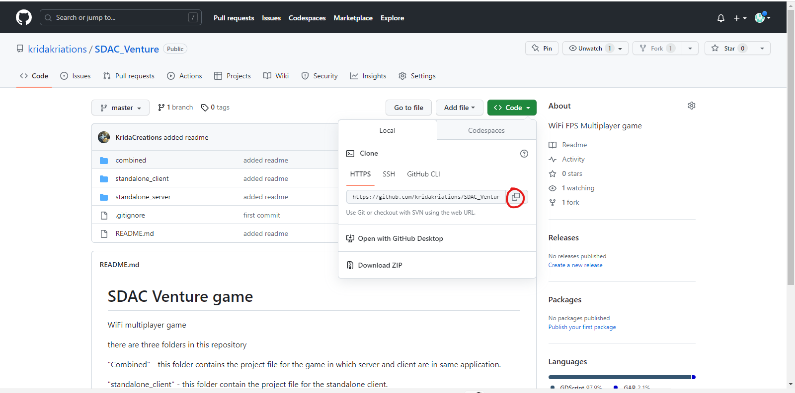

### Clone the repo using command prompt
Go to the command and navigate to the folder where you want to clone the repository

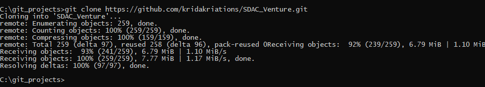

### download the assets for the project you want to edit
    - combined [link](https://drive.google.com/drive/folders/1t5oMZzMebH6w_v4SJYCaopAxQUQGXVGx?usp=drive_link)
    - standalone client [link](https://drive.google.com/drive/folders/1ZN71VC12-Jb3LyeGaktUbAMoclKKDiTq?usp=drive_link)
    - standalone server [link](https://drive.google.com/drive/folders/143e5vAVDik93I1n9MEeagOgboXIzOjVP?usp=drive_link)

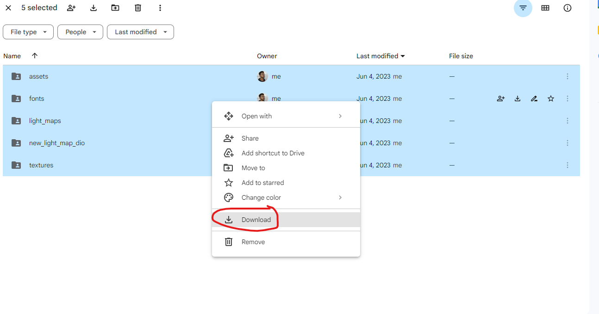    

### copy the assets and paste into project folder you are editing or trying to run

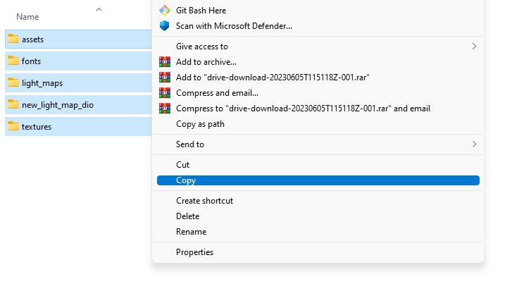

Paste into the project folder you want to run
NOTE - dont copy and paste assets for one project into another project.

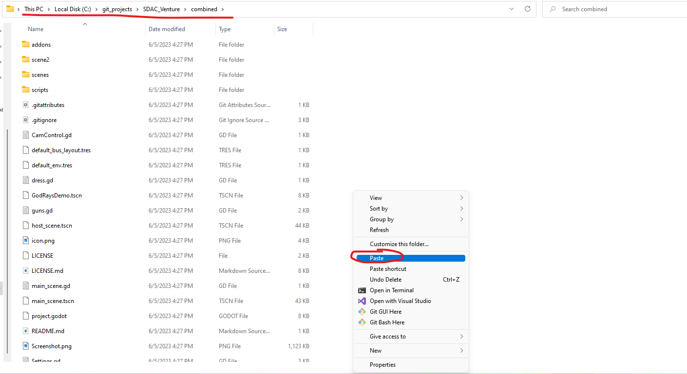

### open the GODOT GAME ENGINE and browse to the project file
Download Godot 3.5 and open it 
you might not see projects listed if it's your first time running the engine
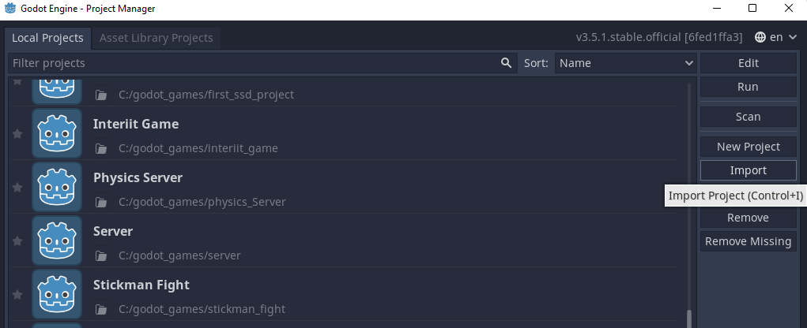

Click on import
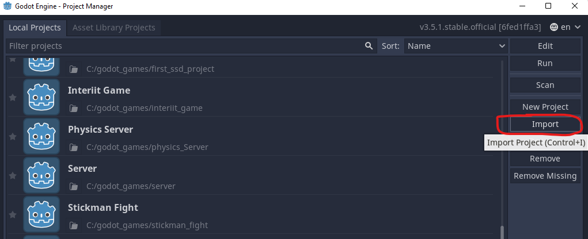

Click on browse option
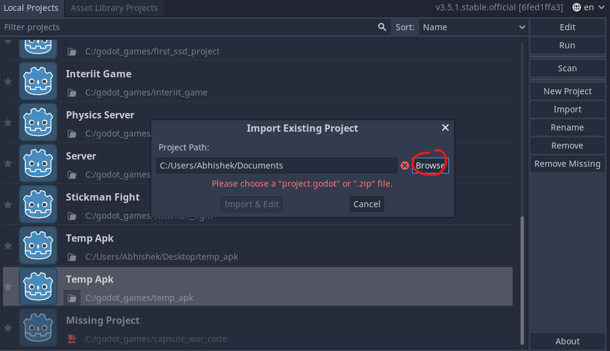

Browse to the "project.godot" file of the project you want to run it is present in the main project directry
Select the project file and click open
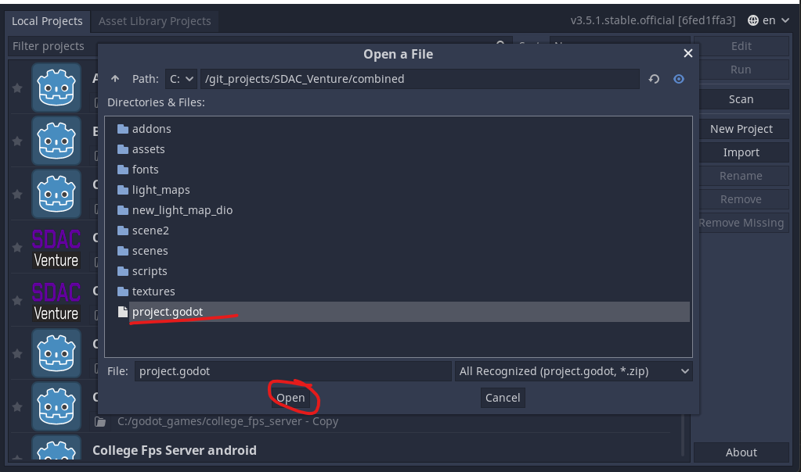

Ignore this warning if it popes up
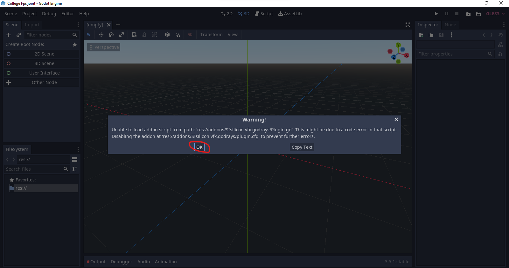

after this it may take some minutes to import the assets after this you are free to run the project

click this button to run the project
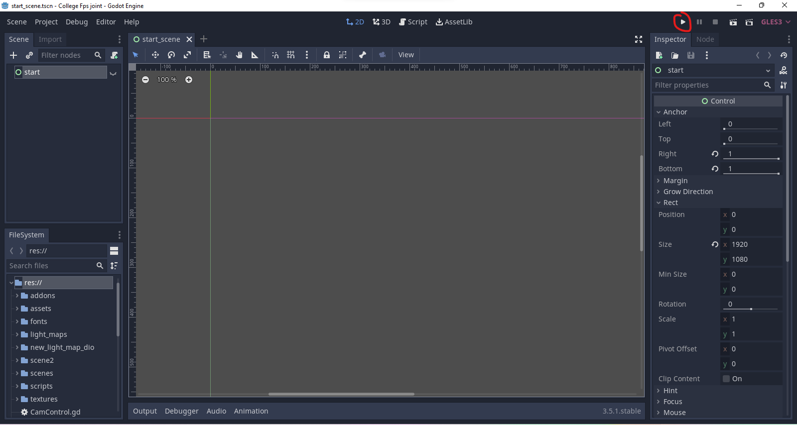

